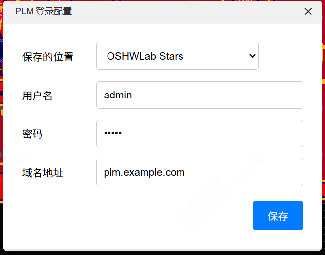
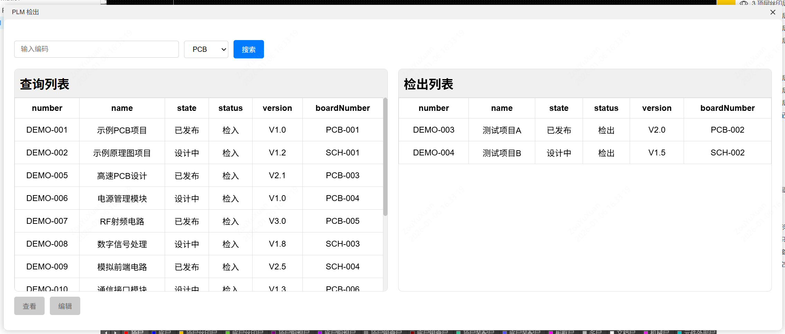
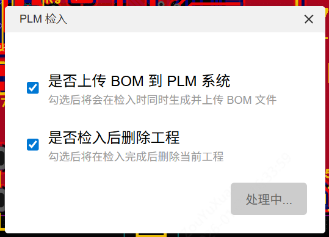

# PLM 案例

嘉立创 EDA 专业版 PLM（产品生命周期管理）对接参考案例扩展。

## 功能特性

- **工程检出**：从 PLM 系统检出工程文件（.epro），自动导入到嘉立创 EDA 并打开
- **工程检入**：将当前工程检入到 PLM 系统
- **BOM 同步**：检入时支持同时生成并上传 BOM 文件到 PLM 系统
- **自动清理**：检入完成后可选择自动删除本地工程(需手动补充地址)
- **多场景支持**：在首页、原理图编辑器、PCB 编辑器中均可使用

> **注意**：本扩展支持 Mock 模式和真实 API 模式切换，可在设置中配置。

## 使用说明

### 1. 配置 PLM 连接

首次使用前，需要配置 PLM 服务器连接信息。

**菜单路径**：`PLM` → `设置...`



配置项说明：
| 配置项 | 说明 |
| ---------- | ------------------------------------------- |
| 保存的位置 | 选择工程保存到哪个团队 |
| 用户名 | PLM 系统登录用户名 |
| 密码 | PLM 系统登录密码 |
| 域名地址 | PLM 服务器地址，如 `http://plm.example.com` |
| API 模式 | 切换 Mock 模式或真实 API 模式 |

### API 模式说明

| 模式      | 说明                                                      |
| --------- | --------------------------------------------------------- |
| Mock 模式 | 使用内置模拟数据，无需真实 PLM 服务器，适合演示和接口测试 |
| 真实 API  | 连接真实 PLM 服务器，调用实际接口进行检入检出操作         |

### 2. 检出工程

从 PLM 系统检出工程文件到本地进行编辑。

**菜单路径**：`PLM` → `PLM 检出...`



操作步骤：

1. 在搜索框输入工程编码进行搜索，或从列表中选择
2. 选择文件类型（PCB 或 原理图）
3. 在「查询列表」中选中要检出的工程
4. 点击「查看」可预览工程（只读导入）
5. 点击「编辑」可检出工程（可编辑导入，状态变为检出）

界面说明：

- **查询列表**：显示 PLM 系统中可检出的工程（状态为「检入」）
- **检出列表**：显示当前已检出的工程（状态为「检出」）

### 3. 检入工程

将编辑完成的工程检入回 PLM 系统。

**菜单路径**：`PLM` → `PLM 检入...`（在原理图或 PCB 编辑器中）



配置选项：
| 选项 | 说明 |
| ------------------------ | --------------------------------------- |
| 是否上传 BOM 到 PLM 系统 | 勾选后将在检入时同时生成并上传 BOM 文件 |
| 是否检入后删除工程 | 勾选后将在检入完成后删除当前工程 |

## 开发指南

### 项目结构

```
eext-plm-integration-demo/
├── src/
│   └── index.ts          # 扩展入口文件
├── iframe/
│   ├── download.html     # 检出界面
│   ├── upload.html       # 检入界面
│   ├── setting.html      # 设置界面
│   └── jszip.min.js      # ZIP 处理库
├── locales/              # 多语言文件
├── images/
│   └── logo.png          # 扩展图标
├── extension.json        # 扩展配置文件
└── package.json          # 项目配置
```

### 构建项目

```bash
# 安装依赖
npm install

# 编译并打包
npm run build
```

### 二次开发说明

本扩展已内置 Mock 模式和真实 API 模式的切换支持。真实 API 模式下会调用以下接口：

#### 设置接口

| 接口              | 方法 | 说明         |
| ----------------- | ---- | ------------ |
| `/api/auth/login` | POST | 用户登录验证 |

#### 检出接口

| 接口                          | 方法 | 说明             |
| ----------------------------- | ---- | ---------------- |
| `/api/projects`               | GET  | 获取工程列表     |
| `/api/projects/search`        | GET  | 搜索工程         |
| `/api/projects/{id}/checkout` | POST | 检出工程（锁定） |
| `/api/projects/{id}/download` | GET  | 下载工程文件     |

#### 检入接口

| 接口                         | 方法 | 说明     |
| ---------------------------- | ---- | -------- |
| `/api/projects/{id}/checkin` | POST | 检入工程 |
| `/api/projects/{id}/bom`     | POST | 上传 BOM |

> 完整的接口定义请参考 `postman/` 目录下的 Postman Collection 文件。

## 相关链接

- [嘉立创 EDA 专业版](https://pro.lceda.cn/)
- [扩展 API 文档](https://prodocs.lceda.cn/cn/extension/started/quick-start/)
- [问题反馈](https://github.com/easyeda/eext-plm-integration-demo/issues)
